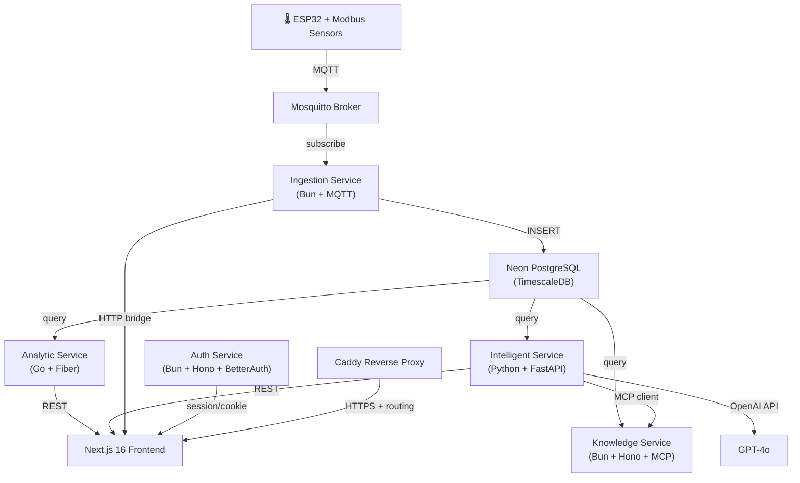
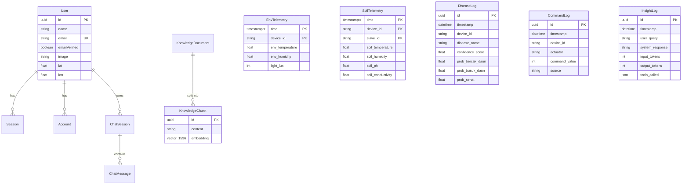

# SiapGrek — Codebase Analysis

> **Sistem Informasi Automasi Perawatan Anggrek** (Orchid Greenhouse Automation Information System)

---

## 1. What Is This?

SiapGrek is a **full-stack IoT platform** for monitoring and automating orchid greenhouse care. It spans from physical sensors (ESP32) all the way to an AI-powered web dashboard, forming a complete vertical slice:



---

## 2. Architecture Overview

### 2.1 Tech Stack Summary

| Layer | Technology | Language |
|---|---|---|
| **IoT Hardware** | ESP32, Modbus RS485 sensors, relay actuators | C++ (Arduino) |
| **MQTT Broker** | Eclipse Mosquitto | — |
| **Data Ingestion** | Bun runtime, MQTT.js, Hono HTTP | TypeScript |
| **Analytics API** | Go Fiber, pgx connection pool | Go |
| **AI/ML Service** | FastAPI, TFLite (CNN disease classifier), OpenAI | Python |
| **Knowledge/MCP** | Bun + Hono, MCP SDK, pgvector RAG | TypeScript |
| **Auth Service** | Bun + Hono, Better Auth | TypeScript |
| **Frontend** | Next.js 16 (App Router), Tailwind, Recharts, Leaflet | TypeScript/React |
| **Database** | Neon Serverless PostgreSQL + TimescaleDB extensions | SQL |
| **Reverse Proxy** | Caddy (auto-HTTPS via Let's Encrypt) | Caddyfile |
| **Orchestration** | Docker Compose | YAML |
| **Schema Management** | Prisma ORM (migrations + code generation) | — |

### 2.2 Service Map (Ports)

| Service | Port | Runtime | Role |
|---|---|---|---|
| **Frontend** | `3000` | Next.js 16 (Vercel) | Web dashboard |
| **auth-service** | `3001` | Bun + Hono | Authentication (Better Auth) |
| **analytic-service** | `3002` | Go + Fiber | Telemetry queries, command-log reads |
| **intelligent-service** | `3003` | Python + FastAPI | Disease CNN, AI insights, chat, knowledge search |
| **knowledge-service** | `3004` | Bun + Hono | MCP server (5 tools), document CRUD |
| **ingestion-service** | `3005` | Bun | MQTT → DB writer, HTTP command bridge |
| **Mosquitto** | `1883` | MQTT broker | Device telemetry transport |
| **Caddy** | `80/443` | Reverse proxy | HTTPS termination, route fanout |

---

## 3. Service Deep-Dives

### 3.1 IoT Firmware (`SiapGrek_V1_lite/`)

- **Platform**: ESP32 with LCD (I2C) + Modbus RS485
- **Sensors** (via Modbus slaves):
  - **Slave 2** (`THCPH`): Soil humidity, soil temperature, EC, pH
  - **Slave 3** (`TARH`): Air temperature, air humidity
  - **Slave 1** (`RELAY`): 3-channel relay actuator (misting/watering)
- **Data flow**: Reads sensors → builds JSON → publishes to MQTT topic `orchid/node1/telemetry`
- **Command reception**: Subscribes to command topics, controls relays via Modbus coils

### 3.2 Ingestion Service (`services/ingestion-service/`)

- **MQTT subscriber**: Listens to `orchid/+/telemetry`, validates with Zod schemas
- **Immediate insertion**: Writes directly to `env_telemetry` and `soil_telemetry` tables in TimescaleDB
- **HTTP Command Bridge**: `POST /api/v1/command` → publishes to MQTT topic `orchid/{device_id}/command/{actuator_kind}/{actuator_id}`
- **Architecture**: Clean separation between `mqtt/`, `http/`, `db/`, and `schemas/`

### 3.3 Analytic Service (`services/analytic-service/`)

- **Language**: Go with Fiber framework
- **Endpoints**:
  - `GET /api/v1/telemetry/latest` — Latest env + soil readings by device
  - `GET /api/v1/telemetry/history` — Historical sensor data with time-range queries
  - `GET /api/v1/command-log` — Activity log (actuator commands)
- **Database**: Direct pgx connection pool to Neon PostgreSQL
- **Structure**: `internal/handlers/` (telemetry.go, command_log.go) + `internal/database/`

### 3.4 Auth Service (`services/auth-service/`)

- **Stack**: Bun + Hono + Better Auth
- **Features**:
  - Email/password authentication
  - 7-day sessions stored in DB
  - Custom user fields: `lat`, `lon` (greenhouse coordinates)
  - CORS configured for trusted origins
- **Tables**: `user`, `session`, `account`, `verification` (Better Auth managed)

### 3.5 Intelligent Service (`services/intelligent-service/`)

The AI brain of the system. This is the most complex service:

- **Disease Classification** (`/predict`, `/predictions`):
  - CNN model (`model_cnn_finetuned_V3.tflite`) for orchid leaf diseases
  - 3 classes: *Bercak Daun*, *Busuk Daun*, *Sehat* (Leaf Spot, Leaf Rot, Healthy)
  - Uploads saved to `/uploads/` directory, predictions logged to `disease_log`

- **Insight Orchestrator** (`/api/v1/insights`):
  - Pre-fetches all MCP tool data (latest sensors, weather, disease log, preferences)
  - Injects context into GPT-4o system prompt with "SiapGrek AI" persona
  - Responses logged to `insight_log` with token counts

- **Chat System** (`/api/v1/chat`, `/api/v1/chat-sessions`):
  - Multi-turn conversation with MCP tool access
  - Sessions persisted in `chat_session` + `chat_message` tables
  - CRUD for chat sessions (list, get, delete)

- **Knowledge Search** (`/api/v1/knowledge/search`):
  - Semantic search using pgvector embeddings
  - Document upload with chunking and embedding generation

### 3.6 Knowledge Service (`services/knowledge-service/`)

- **MCP Server** (Model Context Protocol) — exposes 5 tools:

  | Tool | Description |
  |---|---|
  | `preference` | RAG search over uploaded knowledge documents |
  | `sensor_history` | Historical sensor telemetry from TimescaleDB |
  | `disease_log` | Plant disease classification records |
  | `latest_sensor_data` | Most recent sensor snapshot |
  | `weather_forecast` | OpenWeatherMap 24h forecast by lat/lon |

- **Document API**: CRUD at `/documents` for managing knowledge base documents
- **Connection**: The intelligent-service connects to this via MCP Streamable HTTP

### 3.7 Frontend (`frontend/`)

- **Framework**: Next.js 16 (App Router) with Tailwind CSS
- **Auth**: Better Auth client SDK with cookie-based sessions
- **Routing Structure**:

  ```
  app/
  ├── (auth)/           # Public pages
  │   ├── login/
  │   ├── register/
  │   ├── forgot-password/
  │   └── terms/
  ├── (dashboard)/      # Protected pages
  │   ├── page.tsx      # Main dashboard (sensors, weather, actuators)
  │   ├── penyakit/     # Disease classification
  │   ├── log/          # Activity log
  │   ├── grafik/       # Sensor charts (Recharts)
  │   ├── chat/         # AI chatbot
  │   └── (profile)/    # Profile, password, location, knowledge, FAQ
  └── mobile-profile/   # Mobile-specific profile page
  ```

- **Key Components**: `Sidebar`, `WeatherCard`, `EnvironmentCard`, `SensorCard`, `ControlMenu`, `RecommendationCard`, `ChatSidebar`, `Gauge`, charts (`IntervalGrafik`, `ParameterGrafik`, `RangeGrafik`)
- **Auth Middleware** (`middleware.ts`): Redirects unauthenticated users to `/login`, checks `better-auth.session_token` cookie
- **API Proxy**: All backend calls routed via `next.config.ts` rewrites (no direct service URLs in frontend code)

---

## 4. Database Schema

Managed by Prisma with PostgreSQL + pgvector extension:



---

## 5. Data Flow Walkthrough

### Sensor Data → Dashboard

```
ESP32 → MQTT (orchid/node1/telemetry)
  → ingestion-service (validates + INSERT env_telemetry, soil_telemetry)
  → analytic-service (GET /api/v1/telemetry/latest)
  → Next.js frontend (polls every 10s)
  → Dashboard renders SensorCards, EnvironmentCard
```

### Disease Classification

```
User uploads leaf photo → frontend POST /api/predict
  → intelligent-service runs TFLite CNN inference
  → Returns prediction + confidence + probabilities
  → Background task saves to disease_log + disk
```

### AI Insight Generation

```
User asks question on dashboard → frontend POST /api/insights
  → intelligent-service pre-fetches:
     • latest_sensor_data (via MCP → knowledge-service → DB)
     • weather_forecast (via MCP → OpenWeatherMap API)
     • preference (via MCP → knowledge-service → vector search)
     • disease_log (via MCP → knowledge-service → DB)
  → Injects all context into GPT-4o system prompt
  → Returns markdown recommendation
  → Background task logs to insight_log
```

### Actuator Control

```
User toggles ControlMenu → frontend POST /api/command
  → ingestion-service HTTP bridge
  → Publishes to MQTT: orchid/{device_id}/command/{kind}/{id}
  → ESP32 receives, controls relay via Modbus
  → Command logged in command_log table
```

---

## 6. Infrastructure & Deployment

- **Docker Compose**: Orchestrates mosquitto, caddy, and all 5 backend services on a shared `orchid-net` bridge network
- **Caddy**: Auto-HTTPS reverse proxy at `siapgrek.duckdns.org`, routes by URL path to each service
- **Frontend**: Deployed to **Vercel** (production at `siapgrek.vercel.app`)
- **Database**: **Neon Serverless Postgres** (connection pooler in `ap-southeast-1`)
- **Persistent Volumes**: `mosquitto-data`, `caddy-data`, `caddy-config`

---

## 7. Current Status & Integration Completeness

Based on the `refactor_plan4.md` gap analysis and actual code inspection:

| Feature | Status | Notes |
|---|---|---|
| **Auth (login/register/logout)** | ✅ Connected | Better Auth client integrated, middleware protects routes |
| **UserContext** | ✅ Connected | Hydrates from Better Auth session, supports lat/lon |
| **Dashboard sensors** | ✅ Connected | Polls analytic-service every 10s |
| **Dashboard actuator status** | ✅ Connected | Reads from command-log API |
| **Sensor charts (Grafik)** | ✅ Connected | Fetches telemetry history |
| **Disease classification** | ✅ Connected | Real CNN model via intelligent-service |
| **Activity log** | ✅ Connected | Backend endpoint exists, frontend reads from it |
| **AI Chat** | ✅ Connected | Multi-turn chat with MCP tool access |
| **AI Insights** | ✅ Connected | Pre-fetches context, generates recommendations |
| **Actuator control** | ✅ Connected | HTTP → MQTT bridge operational |
| **Knowledge base (RAG)** | ✅ Connected | Document CRUD + vector search |
| **Profile management** | ✅ Connected | Edit profile, location picker, password change |
| **Weather** | ⚠️ Partial | Via MCP tool, but WeatherCard source unclear |
| **Forgot password** | ⚠️ Partial | UI exists but actual email/OTP flow uncertain |

---

## 8. Key Observations

### Strengths
- **Polyglot done right**: Each service uses the best language for the job (Go for performance, Python for ML, TypeScript for I/O-heavy services)
- **Clean MCP integration**: Knowledge-service as a tool provider is an elegant pattern for AI context
- **Full vertical integration**: Physical sensors → cloud DB → AI → web dashboard is genuinely end-to-end
- **Proper auth**: Better Auth with DB-backed sessions, middleware protection, cookie-based auth

### Areas to Watch
- **`insights.py` has duplicated code**: The system prompt and imports are defined twice (lines 1-55 and lines 59-114)
- **`sensor_history` tool has a bug**: `params` is referenced before being defined (line 121, no `const params: string[] = []` before the `if`)
- **Hardcoded MQTT relay control** in firmware: `loop()` always turns on relays 0-2 regardless of command
- **No rate limiting** on AI endpoints (insights, chat) — could result in high OpenAI costs
- **`.env` file is in the repo** with real secrets (API keys, DB credentials) — security risk
