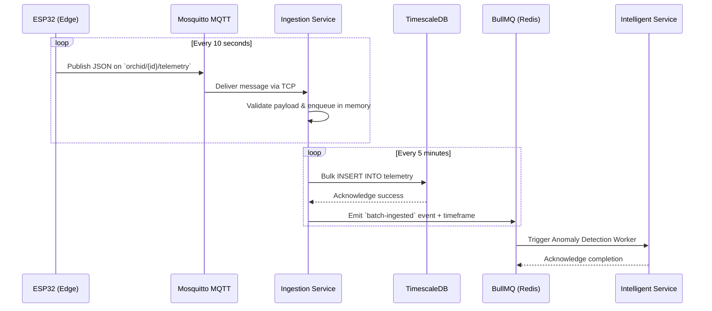

## Context

The system relies on continuous telemetry readings from ESP32 edge nodes deployed in greenhouses. These nodes publish environment, soil, and light data via MQTT every 10 seconds. We need a robust pipeline to subscribe to these MQTT topics, sanitize the incoming JSON payload, buffer it in memory, and insert it iteratively into TimescaleDB. The core operational challenge is managing the write throughput. To avoid massive I/O saturation on the PostgreSQL database from highly frequent individual inserts, we will batch write data on a 5-minute interval. Additionally, downstream intelligence services rely on asynchronous notification that a new batch of data is available to perform anomaly detection without impeding the main ingestion pipeline.

## Goals / Non-Goals

**Goals:**
- Reliable connection and subscription to continuous telemetry from the `orchid/+/telemetry` MQTT topics using Bun + TypeScript.
- Strict payload validation using Zod.
- Memory-safe buffering of incoming messages.
- Efficient bulk inserts to the TimescaleDB `telemetry` hypertable every 5 minutes.
- Publish a BullMQ job/event whenever a batch insert is completed to signal downstream processors.

**Non-Goals:**
- Any form of read/API endpoint to query this telemetry (belongs to `analytic-service`).
- Parsing or interacting with MQTT command/actuator flows (unless required by edge states, but strictly out of scope for the telemetry worker).
- Executing actual anomaly detection or AI models upon receipt.

## Sequence Flow

## Decisions

1. **Bun as the Runtime + TypeScript:**
   *Rationale:* Bun provides an exceptionally fast JavaScript runtime with built-in TypeScript support, zero-overhead FFI, and excellent memory management suitable for concurrent event-driven loops.
   *Alternatives Considered:* Node.js was considered but rejected due to slightly higher startup times and the extra tooling configuration required for TS execution.

2. **Zod for Runtime Validation:**
   *Rationale:* Telemetry from unreliable edge devices must be strictly sanitized before hitting the database. Zod guarantees shape and strips out malformed data gracefully.

3. **In-Memory Buffer with 5-Minute Flush Interval:**
   *Rationale:* The fundamental trade-off of this pipeline. Buffering in-memory drastically lowers PostgreSQL connections, locking, and IOPS, ensuring extreme sustained stability. We use a background timer to flush the payload arrays natively.
   *Alternatives Considered:* Inserting every single reading directly (causes DB bottleneck); using an intermediate TimescaleDB continuous aggregate feature (more complex, doesn't solve write I/O limit natively without batch hooks).

4. **BullMQ for Inter-Service Notifications:**
   *Rationale:* Redis-backed BullMQ is persistent and retryable. Emitting an event ensures the Intelligent Service can process at its own pace without blocking the Ingestion Service's synchronous DB flush operations.

## Risks / Trade-offs

- **[Risk] Data loss on Service Crash/Restart:** If the ingestion service crashes midway through a 5-minute window, the buffered memory is lost.
  → *Mitigation:* The 5-minute batch window bounds maximum data loss to 5 minutes, which is acceptable in this greenhouse monitoring domain where rapid anomalies are handled later with RAG interpolations if missed slightly. Edge devices might also implement basic fallback ring buffers later if needed.
- **[Risk] High Memory Usage on MQTT Message Spike:** A sudden influx of massive messages might OOM the container.
  → *Mitigation:* Implement a max-buffer-size threshold. If the queue length exceeds a safe upper bound (e.g., 50,000 items), force an early flush to the DB instead of waiting for the timer.
- **[Risk] DB Connection Timeout during Massive Batching:** 
  → *Mitigation:* Use Prisma's `createMany` for raw query batching under a transaction, or a raw SQL batch insert heavily optimized for TimescaleDB to ensure it fits within packet configurations.
- **[Trade-off] High-Latency for AI Action vs Operational Stability:** 
  → *Trade-off explanation:* Because data is only saved every 5 minutes, asynchronous ML anomaly detection has a 5-minute floor on its latency to spot trends.
  → *Mitigation:* Service-level instantaneous control (Fuzzy logic) takes place instantly inside the Intelligent Service directly reading active states, but heavy historical trend processing correctly belongs asynchronously behind the Timescale batch to retain horizontal stability.
