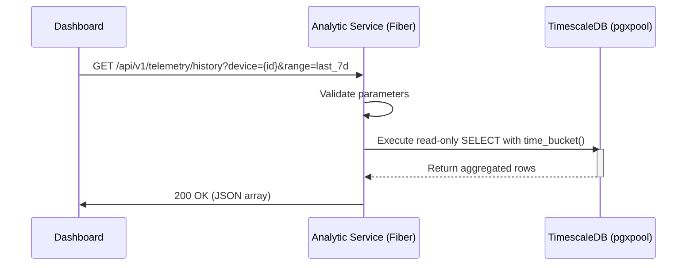

## Context

The Greenhouse Orchid IoT System relies on TimescaleDB for time-series telemetry storage. The system generates high volumes of continuous sensor readings from ESP32 edge nodes, ingested by the `ingestion-service` every 5 minutes in large batches. Concurrently, the frontend dashboard requires real-time and historical data visualizations. Querying historical and aggregated data directly from the monolithic ingestion or core services risks CPU and I/O contention, which could bottleneck the critical insertion pipeline and destabilize edge communication. 

The `analytic-service` is being introduced as a decoupled, high-performance read-replica/query engine using Go and Fiber to solve this. It will explicitly handle heavy read workloads to TimescaleDB, serving the frontend with blazing-fast aggregations without impacting other critical components.

## Goals / Non-Goals

**Goals:**
- Provide extremely fast sub-millisecond to low-millisecond read API endpoints for historical telemetry data over varying timeframes natively optimized using TimescaleDB hypertable structures.
- Use Go and the Fiber framework to ensure low memory footprint, high concurrency limits, and fast cold-start/compilation times within an Alpine Docker container.
- Prevent read queries from exhausting the database connection pool required by the `ingestion-service` and `intelligent-service`.
- Gracefully handle database query timeouts or unreachable states to prevent dashboard cascading failures.

**Non-Goals:**
- No data mutation, writing, or DB ingestion logic. Database interactions are strictly read-only (`SELECT`).
- No natural language processing or RAG features; this is purely a query engine.
- No user identity management (to be managed externally or via a future API gateway/`auth-service` JWT validation).

## Decisions

### 1. Choice of Language and Web Framework (Go + Fiber)
* **Decision**: Use Go with the Fiber web framework.
* **Rationale**: Go provides unmatched concurrency handling natively via goroutines, making it perfect for I/O bound database querying. Fiber (built on `fasthttp`) is consistently ranked as one of the fastest HTTP engines, minimizing completely the overhead of the web server itself.
* **Alternatives Considered**: Bun/Elysia or Python/FastAPI. Python is too slow for pure I/O heavy API gateways. Bun is fast, but Go provides a mathematically smaller compiled footprint, more rigid typing for complex DB query logic, and more mature SQL pooling libraries out of the box (`pgx`).

### 2. Database Driver and Connection Pooling (`pgxpool`)
* **Decision**: Use `jackc/pgx/v5/pgxpool` as the PostgreSQL driver.
* **Rationale**: `pgx` is the standard, most performant Postgres driver for Go. Using `pgxpool` ensures we leverage an optimized, concurrency-safe connection pool. We will set bounded limits (e.g., `MaxConns=20`) dedicated solely to read operations, ensuring the analytic service never hogs all DB sockets.
* **Alternatives Considered**: `database/sql` with `lib/pq` (older, less performant, lacking advanced Postgres types native to `pgx`) or GORM (adds unnecessary ORM overhead for pure optimized time-series aggregation queries).

### 3. Query Optimization Pattern
* **Decision**: Rely purely on raw SQL utilizing TimescaleDB's native functions (e.g., `time_bucket`) for aggregations rather than processing raw data in-memory within Go.
* **Rationale**: TimescaleDB is fundamentally optimized for downsampling and continuous aggregation. Moving the structural compute to the DB layer saves immense network bandwidth and application memory. Go merely passes the pre-aggregated results directly to the caller as JSON.

### Sequence Flow (Read Request)

## Risks / Trade-offs

- **[Risk: Heavy Query Load]** Deep historical queries (e.g., 6 months of raw data) could still bottleneck TimescaleDB I/O, slowing down the system globally despite a decoupled service.
  - *Mitigation*: The `analytic-service` must enforce strict pagination limits and forcefully limit the maximum query range without aggregation. If deep timeframe data is requested, it MUST be requested using a `time_bucket` (e.g., daily averages) rather than requesting millions of raw unaggregated telemetry points. We will implement strict request context timeouts (e.g., 5 seconds) to kill hanging DB queries.

- **[Trade-off: Direct DB access vs Querying through Ingestion Service]** 
  - Having multiple services talk to the database direct complicates DB schema synchronization. However, the performance benefit of a dedicated read pool in a compiled language vastly outweighs the architectural purity of forcing all data through the ingestion API layer.

- **[Risk: DB Connection Exhaustion]**
  - *Mitigation*: The Fiber service startup will configure strict `pgxpool` limits (`MaxConns`) and connection max lifetime / idle timeouts to ensure dead connections yield immediately.
