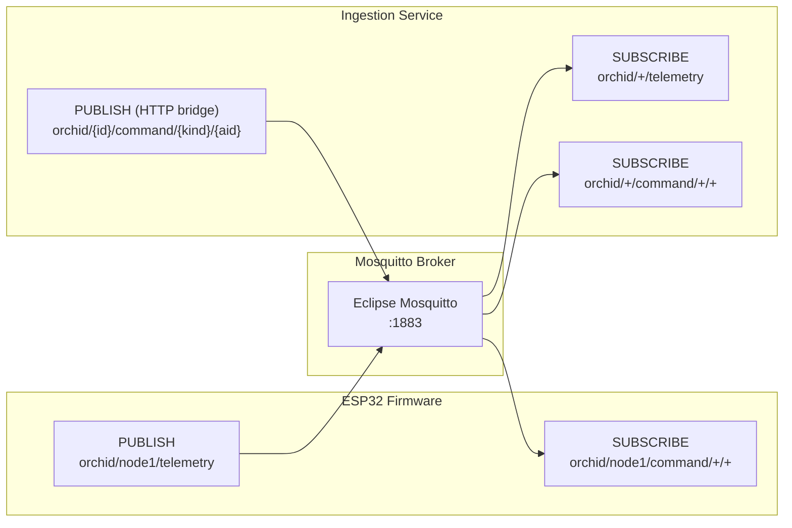
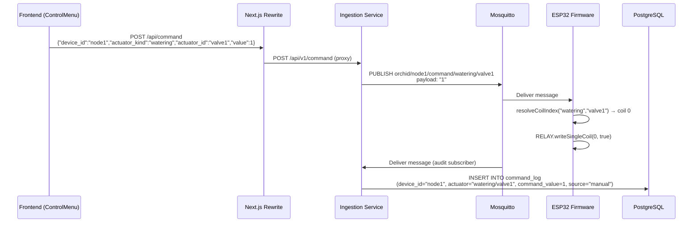

# SiapGrek — MQTT Payload Contracts & Integration Guide

> End-to-end payload definitions between firmware, MQTT broker, and backend services.

---

## 1. MQTT Topic Architecture



### Topic Patterns

| Topic Pattern | Direction | Publisher | Subscriber(s) |
|---|---|---|---|
| `orchid/{device_id}/telemetry` | Device → Cloud | ESP32 firmware | ingestion-service |
| `orchid/{device_id}/command/{actuator_kind}/{actuator_id}` | Cloud → Device | ingestion-service (HTTP bridge) | ESP32 firmware, ingestion-service (audit log) |

---

## 2. Telemetry Payload (Device → Cloud)

### Topic
```
orchid/{device_id}/telemetry
```
Example: `orchid/node1/telemetry`

### JSON Schema

```jsonc
{
  // ISO 8601 timestamp from device's NTP-synced clock
  "timestamp": "2026-05-19T03:00:00+0700",

  // Environmental sensors (air temperature/humidity from Modbus Slave 3)
  "environment": {
    "temperature": 28.5,   // °C — Air temperature
    "humidity": 72.3       // %  — Relative humidity
  },

  // Light sensor (placeholder — no physical lux sensor yet)
  "light": {
    "lux": 0               // lux — Light intensity (0 = not connected)
  },

  // Soil sensor array (each element = one Modbus soil probe)
  // Currently: 1 probe on Modbus Slave 2 (THCPH sensor)
  "soil_sensors": [
    {
      "slave_id": "thcph_1",      // Unique identifier for this soil probe
      "temperature": 24.5,        // °C — Soil temperature
      "humidity": 62.0,           // %  — Soil moisture
      "ph": 6.3,                  // pH value (0-14 scale)
      "ec": 1.1                   // mS/cm — Electrical conductivity
    }
  ]
}
```

### Zod Validation (ingestion-service)

The payload is validated by [telemetry.schema.ts](file:///c:/dev/siapgrek/services/ingestion-service/src/schemas/telemetry.schema.ts):

```typescript
const TelemetryPayloadSchema = z.object({
    soil_sensors: z.array(SoilSensorSchema).optional(),
    environment: z.object({
        temperature: z.number(),
        humidity: z.number(),
    }),
    light: z.object({
        lux: z.number(),
    }),
    timestamp: z.coerce.date(),
});
```

> [!IMPORTANT]
> - `soil_sensors` is **optional** — if the soil probe read fails, the firmware omits it entirely
> - `ec` is in **mS/cm** (firmware converts from raw µS/cm ÷ 1000)
> - `timestamp` is coerced to a `Date` — both ISO strings and epoch values work

### Database Mapping

| JSON Field | DB Table | DB Column |
|---|---|---|
| `environment.temperature` | `env_telemetry` | `env_temperature` |
| `environment.humidity` | `env_telemetry` | `env_humidity` |
| `light.lux` | `env_telemetry` | `light_lux` |
| `soil_sensors[].slave_id` | `soil_telemetry` | `slave_id` |
| `soil_sensors[].temperature` | `soil_telemetry` | `soil_temperature` |
| `soil_sensors[].humidity` | `soil_telemetry` | `soil_humidity` |
| `soil_sensors[].ph` | `soil_telemetry` | `soil_ph` |
| `soil_sensors[].ec` | `soil_telemetry` | `soil_conductivity` |

---

## 3. Command Payload (Cloud → Device)

### Topic
```
orchid/{device_id}/command/{actuator_kind}/{actuator_id}
```
Examples:
- `orchid/node1/command/watering/valve1`
- `orchid/node1/command/misting/pump1`
- `orchid/node1/command/misting/pump2`

### Payload
```
0    ← OFF
1    ← ON
```
Plain text integer. No JSON wrapping.

### Flow: Frontend → Device



### HTTP Bridge Request Format

```jsonc
// POST /api/v1/command (ingestion-service :3005)
{
  "device_id": "node1",          // Must match device's CONFIG_DEVICE_ID
  "actuator_kind": "watering",   // One of: "watering", "misting"
  "actuator_id": "valve1",       // One of: "valve1", "pump1", "pump2"
  "value": 1                     // 0 = OFF, 1 = ON
}
```

### Command Log DB Record

| Column | Value | Source |
|---|---|---|
| `device_id` | `"node1"` | From topic segment [1] |
| `actuator` | `"watering/valve1"` | `{kind}/{id}` concatenated |
| `command_value` | `1` | From MQTT payload |
| `source` | `"manual"` | Set by ingestion-service |

---

## 4. Relay-to-Actuator Mapping

This mapping is the **critical contract** between the physical hardware and the web dashboard. It is defined in three places that MUST stay in sync:

| Actuator | `actuator_kind` | `actuator_id` | Relay Coil | firmware `#define` |
|---|---|---|---|---|
| Penyiraman (Watering Valve 1) | `watering` | `valve1` | Coil 0 | `RELAY_COIL_WATERING_VALVE1` |
| Misting (Pump 1) | `misting` | `pump1` | Coil 1 | `RELAY_COIL_MISTING_PUMP1` |
| Misting (Pump 2) | `misting` | `pump2` | Coil 2 | `RELAY_COIL_MISTING_PUMP2` |

### Source Files That Define This Mapping

| Layer | File | How It's Defined |
|---|---|---|
| **Firmware** | [config.h](file:///c:/dev/siapgrek/SiapGrek_V1_lite/config.h) | `#define RELAY_COIL_*` constants |
| **Firmware** | [SiapGrek_V1_lite.ino](file:///c:/dev/siapgrek/SiapGrek_V1_lite/SiapGrek_V1_lite.ino#L264-L278) | `resolveCoilIndex()` function |
| **Frontend** | [ControlMenu.tsx](file:///c:/dev/siapgrek/frontend/components/ControlMenu.tsx#L20-L48) | `controls` state array with `kind` + `actuatorId` |
| **Backend** | [server.ts](file:///c:/dev/siapgrek/services/ingestion-service/src/http/server.ts#L25-L57) | HTTP bridge constructs topic from body fields |
| **Backend** | [client.ts](file:///c:/dev/siapgrek/services/ingestion-service/src/mqtt/client.ts#L56-L79) | Audit logger parses topic segments |

> [!WARNING]
> If you add a new actuator (e.g. a fan), you must update **all five** of these files:
> 1. Add a `#define` in `config.h`
> 2. Add a case in `resolveCoilIndex()` in the `.ino`
> 3. Add an entry in the `controls` array in `ControlMenu.tsx`
> 4. The HTTP bridge and audit logger are generic (no changes needed)

---

## 5. Modbus Register Map

### Slave 2 — THCPH (Soil Sensor)

| Register | Address | Type | Unit | Scale | Variable |
|---|---|---|---|---|---|
| Soil Humidity | `0x0000` | Holding | % | ÷ 10 | `soilHumidity` |
| Soil Temperature | `0x0001` | Holding | °C | ÷ 10 | `soilTemperature` |
| Conductivity (EC) | `0x0002` | Holding | µS/cm | raw | `soilEcRaw` |
| Soil pH | `0x0003` | Holding | pH | ÷ 10 | `soilPh` |

### Slave 3 — TARH (Environment Sensor)

| Register | Address | Type | Unit | Scale | Variable |
|---|---|---|---|---|---|
| Air Temperature | `0x0001` | Input | °C | ÷ 10 | `envTemperature` |
| Air Humidity | `0x0002` | Input | % | ÷ 10 | `envHumidity` |

### Slave 1 — RELAY (Actuator Module)

| Coil | Address | Function |
|---|---|---|
| 0 | `0x0000` | Watering Valve 1 |
| 1 | `0x0001` | Misting Pump 1 |
| 2 | `0x0002` | Misting Pump 2 |

---

## 6. What Changed (Summary)

### Firmware (`SiapGrek_V1_lite.ino`)
- **Telemetry payload**: Changed from flat `{ soil: {...}, environment: {...}, light: {...} }` to the backend's expected `{ soil_sensors: [{slave_id, ...}], environment: {...}, light: {...} }` format
- **Command handling**: Added proper MQTT subscription to `orchid/node1/command/+/+` with topic parsing and relay mapping (was: hardcoded `relay_on`/`relay_off` string matching)
- **Removed**: Unconditional relay activation in `loop()` (was turning on all 3 relays every cycle)
- **Added**: WiFi reconnect timeout, MQTT reconnection loop, NTP dual-server, LCD status display, clean timing via `millis()`

### Config (`config.h`)
- **Topics**: Changed from leading-slash topics (`/orchid/node1/telemetry`) to correct format (`orchid/node1/telemetry`)
- **Added**: Relay coil mapping defines, timing constants, device identity
- **Added**: Wildcard command subscription topic

### Test Publisher (`test-publish.ts`)
- **Fixed**: Was using flat `soil: {...}` object instead of `soil_sensors` array — would have failed Zod validation
